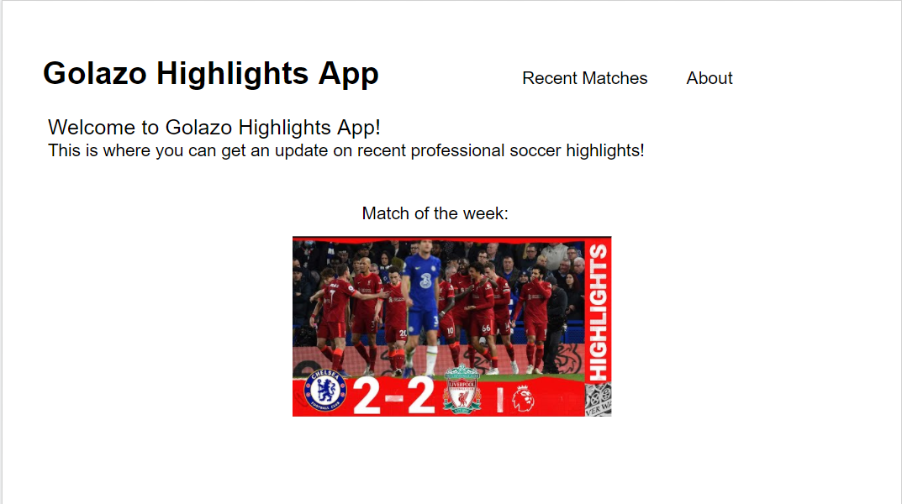
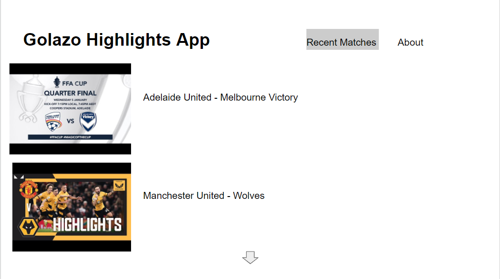
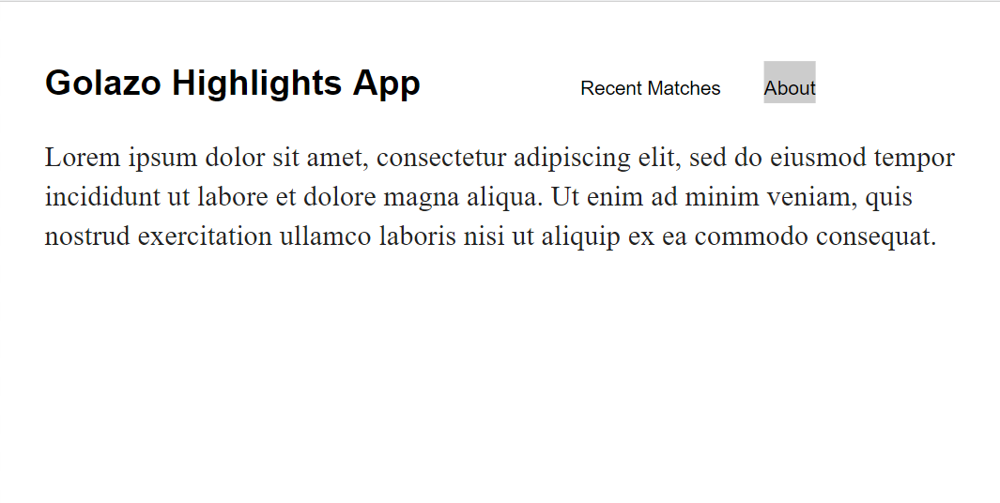

# Golazo Highlights App

## Description

A  React based app that allows users to watch highlights of footall(soccer) matches of the week using JSX, CSS and react features. Users can see list of matches through thumbnails which when clicked will take them to a video of the match supplied by Youtube.

## Planning Process

### User Stories

-As a user, I want to see a list of recent matches with something describing who is playing in the match
-As a user, I was to clock on the match to view additional information and a ink to the highlight game itself
-As a user I want a suggestion to watch on the home page of the app
-As a user I want to easily return to the home screen so I can watch the next match
#### MVP

Display thumbnails in a list from API in a list with information included from each match with some sort of description
Create paths to components using react and react-router-dom
Path that can be directed to the video match itself

#### Stretch

-As a user, I would like the matches to be filtered by leagues to determine which I would want to watch
-As a user, I would like to see team standings in there respective leagues
-As a user, I would like to see football news updates
-As a user, I would like to see upcoming matches

### Wireframes

